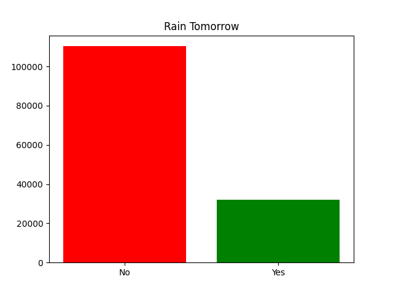
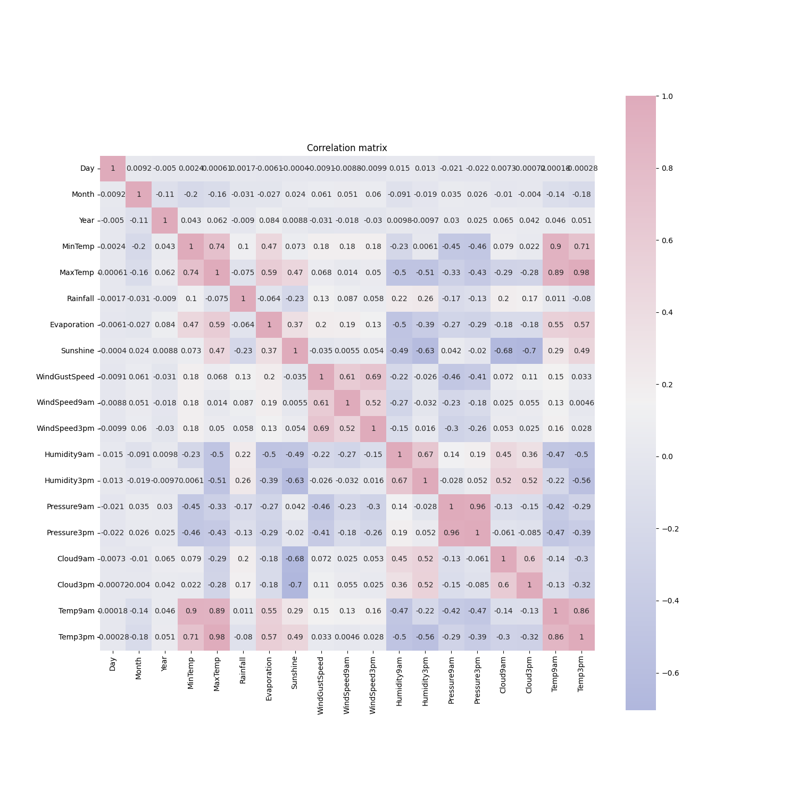

# 1. MachineLearning
## 1.1. About Dataset

### 1.1.1. Source & Acknowledgements
Dataset: [weather dataset](https://www.kaggle.com/datasets/jsphyg/weather-dataset-rattle-package/data)
Copyright Commonwealth of Australia 2010, Bureau of Meteorology.

### 1.1.2. Content
The dataset contains about 10 years of daily weather observations from different locations across Australia. Observations were drawn from numerous weather stations.

### 1.1.3. Task
In this project, I will use this data to predict whether or not it will rain the next day. There are 23 attributes including the target variable "RainTomorrow", indicating whether or not it will rain the next day or not.

### 1.1.4. Data description
| Name          | Description                                                                                                            | Type            |
| ------------- | ---------------------------------------------------------------------------------------------------------------------- | --------------- |
| Date          | The date of observation                                                                                                | 'str'           |
| Location      | The common name of the location of the weather station;                                                                | 'str'           |
| MinTemp       | The minimum temperature in degrees celsius                                                                             | 'numpy.float64' |
| MaxTemp       | The maximum temperature in degrees celsius                                                                             | 'numpy.float64' |
| Rainfall      | The amount of rainfall recorded for the day in mm                                                                      | 'numpy.float64' |
| Evaporation   | The so-called Class A pan evaporation (mm) in the 24 hours to 9am                                                      | 'numpy.float64' |
| Sunshine      | The number of hours of bright sunshine in the day.                                                                     | 'numpy.float64' |
| WindGustDir   | The direction of the strongest wind gust in the 24 hours to midnight                                                   | 'str'           |
| WindGustSpeed | The speed (km/h) of the strongest wind gust in the 24 hours to midnight                                                | 'numpy.float64' |
| WindDir9am    | Direction of the wind at 9am                                                                                           | 'str'           |
| WindDir3pm    | Direction of the wind at 3pm                                                                                           | 'str'           |
| WindSpeed9am  | Wind speed (km/hr) averaged over 10 minutes prior to 9am                                                               | 'numpy.float64' |
| WindSpeed3pm  | Wind speed (km/hr) averaged over 10 minutes prior to 3pm                                                               | 'numpy.float64' |
| Humidity9am   | Humidity (percent) at 9am                                                                                              | 'numpy.float64' |
| Humidity3pm   | Humidity (percent) at 3pm                                                                                              | 'numpy.float64' |
| Pressure9am   | Atmospheric pressure (hpa) reduced to mean sea level at 9am                                                            | 'numpy.float64' |
| Pressure3pm   | Atmospheric pressure (hpa) reduced to mean sea level at 3pm                                                            | 'numpy.float64' |
| Cloud9am      | Fraction of sky obscured by cloud at 9am. This is measured in "oktas", which are a unit of eigths. It records how many | 'numpy.float64' |
| Cloud3pm      | Fraction of sky obscured by cloud (in "oktas": eighths) at 3pm. See Cload9am for a description of the values           | 'numpy.float64' |
| Temp9am       | Temperature (degrees C) at 9am                                                                                         | 'numpy.float64' |
| Temp3pm       | Temperature (degrees C) at 3pm                                                                                         | 'numpy.float64' |
| RainToday     | Boolean: 1 if precipitation (mm) in the 24 hours to 9am exceeds 1mm, otherwise 0                                       | 'str'           |
| RainTomorrow  | The amount of next day rain in mm. Used to create response variable RainTomorrow. A kind of measure of the "risk".     | 'str'           |

* The dataset has missing values
* Numeric and categorical values

## 1.2. DATA VISUALIZATION AND CLEANING

a
