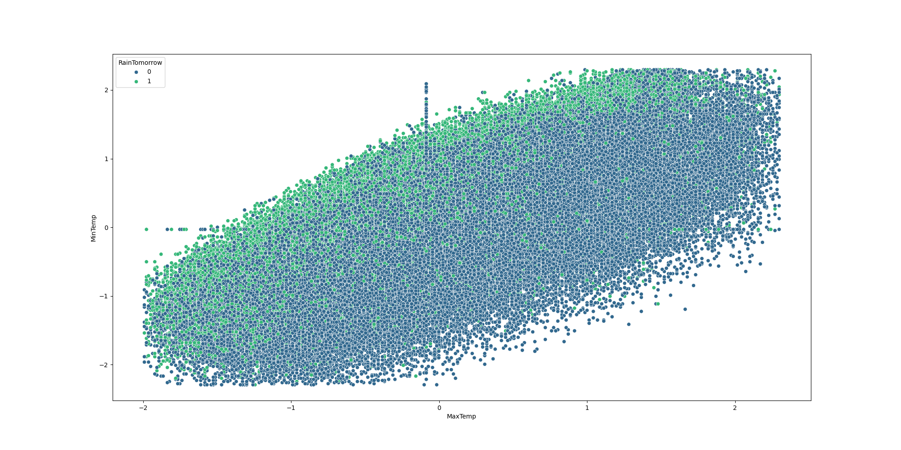
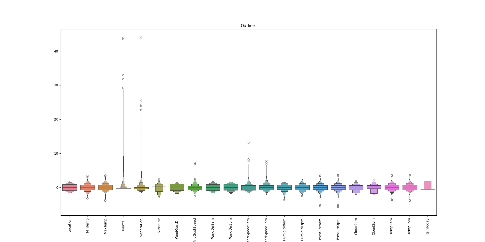
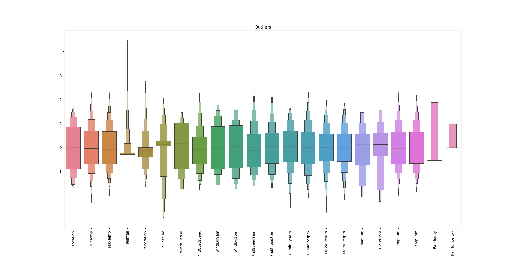
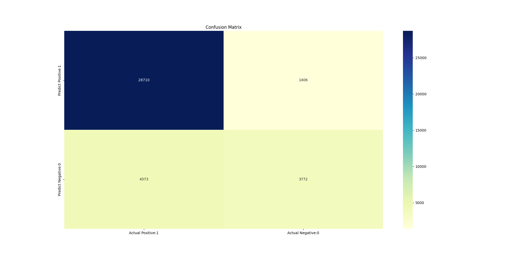

# 1. MachineLearning (HW 4)
## 1.1. About Dataset

### 1.1.1. Source & Acknowledgements
Dataset: [weather dataset](https://www.kaggle.com/datasets/jsphyg/weather-dataset-rattle-package/data)
Copyright Commonwealth of Australia 2010, Bureau of Meteorology.

### 1.1.2. Content
The dataset contains about 10 years of daily weather observations from different locations across Australia. Observations were drawn from numerous weather stations.

### 1.1.3. Task
In this project, I will use this data to predict whether or not it will rain the next day. There are 23 attributes including the target variable "RainTomorrow", indicating whether or not it will rain the next day or not.

### 1.1.4. Data description
| Name          | Description                                                                                                            | Type            |
| ------------- | ---------------------------------------------------------------------------------------------------------------------- | --------------- |
| Date          | The date of observation                                                                                                | 'str'           |
| Location      | The common name of the location of the weather station;                                                                | 'str'           |
| MinTemp       | The minimum temperature in degrees celsius                                                                             | 'numpy.float64' |
| MaxTemp       | The maximum temperature in degrees celsius                                                                             | 'numpy.float64' |
| Rainfall      | The amount of rainfall recorded for the day in mm                                                                      | 'numpy.float64' |
| Evaporation   | The so-called Class A pan evaporation (mm) in the 24 hours to 9am                                                      | 'numpy.float64' |
| Sunshine      | The number of hours of bright sunshine in the day.                                                                     | 'numpy.float64' |
| WindGustDir   | The direction of the strongest wind gust in the 24 hours to midnight                                                   | 'str'           |
| WindGustSpeed | The speed (km/h) of the strongest wind gust in the 24 hours to midnight                                                | 'numpy.float64' |
| WindDir9am    | Direction of the wind at 9am                                                                                           | 'str'           |
| WindDir3pm    | Direction of the wind at 3pm                                                                                           | 'str'           |
| WindSpeed9am  | Wind speed (km/hr) averaged over 10 minutes prior to 9am                                                               | 'numpy.float64' |
| WindSpeed3pm  | Wind speed (km/hr) averaged over 10 minutes prior to 3pm                                                               | 'numpy.float64' |
| Humidity9am   | Humidity (percent) at 9am                                                                                              | 'numpy.float64' |
| Humidity3pm   | Humidity (percent) at 3pm                                                                                              | 'numpy.float64' |
| Pressure9am   | Atmospheric pressure (hpa) reduced to mean sea level at 9am                                                            | 'numpy.float64' |
| Pressure3pm   | Atmospheric pressure (hpa) reduced to mean sea level at 3pm                                                            | 'numpy.float64' |
| Cloud9am      | Fraction of sky obscured by cloud at 9am. This is measured in "oktas", which are a unit of eigths. It records how many | 'numpy.float64' |
| Cloud3pm      | Fraction of sky obscured by cloud (in "oktas": eighths) at 3pm. See Cload9am for a description of the values           | 'numpy.float64' |
| Temp9am       | Temperature (degrees C) at 9am                                                                                         | 'numpy.float64' |
| Temp3pm       | Temperature (degrees C) at 3pm                                                                                         | 'numpy.float64' |
| RainToday     | Boolean: 1 if precipitation (mm) in the 24 hours to 9am exceeds 1mm, otherwise 0                                       | 'str'           |
| RainTomorrow  | The amount of next day rain in mm. Used to create response variable RainTomorrow. A kind of measure of the "risk".     | 'str'           |

* The dataset has missing values
* Numeric and categorical values


## 1.2. DATA VISUALIZATION AND CLEANING
  Categorical variables: ['Date', 'Location', 'WindGustDir', 'WindDir9am', 'WindDir3pm', 'RainToday', 'RainTomorrow']
  | variables    | Missing values |
  | ------------ | -------------- |
  | Date         | 0              |
  | Location     | 0              |
  | WindGustDir  | 10326          |
  | WindDir9am   | 10566          |
  | WindDir3pm   | 4228           |
  | RainToday    | 3261           |
  | RainTomorrow | 3267           |

  Categorical variables: ['Date', 'Location', 'WindGustDir', 'WindDir9am', 'WindDir3pm', 'RainToday', 'RainTomorrow']
  | variables     | Missing values |
  | ------------- | -------------- |
  | MinTemp       | 1485           |
  | MaxTemp       | 1261           |
  | Rainfall      | 3261           |
  | Evaporation   | 62790          |
  | Sunshine      | 69835          |
  | WindGustSpeed | 10263          |
  | WindSpeed9am  | 1767           |
  | WindSpeed3pm  | 3062           |
  | Humidity9am   | 2654           |
  | Humidity3pm   | 4507           |
  | Pressure9am   | 15065          |
  | Pressure3pm   | 15028          |
  | Cloud9am      | 55888          |
  | Cloud3pm      | 59358          |
  | Temp9am       | 1767           |
  | Temp3pm       | 3609           |





## 1.3. DATA PREPROCESSING
### 1.3.1. Describe value

|               | count    | mean          | std      | min       | 25%       | 50%       | 75%       | max       |
| ------------- | -------- | ------------- | -------- | --------- | --------- | --------- | --------- | --------- |
| Location      | 145460.0 | 7.815677e-18  | 1.000003 | -1.672228 | -0.899139 | 0.014511  | 0.857881  | 1.701250  |
| MinTemp       | 145460.0 | -4.501830e-16 | 1.000003 | -3.250525 | -0.705659 | -0.030170 | 0.723865  | 3.410112  |
| MaxTemp       | 145460.0 | 3.001220e-16  | 1.000003 | -3.952405 | -0.735852 | -0.086898 | 0.703133  | 3.510563  |
| Rainfall      | 145460.0 | 7.815677e-18  | 1.000003 | -0.275097 | -0.275097 | -0.275097 | -0.203581 | 43.945571 |
| Evaporation   | 145460.0 | -3.282584e-17 | 1.000003 | -1.629472 | -0.371139 | -0.119472 | 0.006361  | 43.985108 |
| Sunshine      | 145460.0 | -5.424080e-16 | 1.000003 | -2.897217 | 0.076188  | 0.148710  | 0.257494  | 2.360634  |
| WindGustDir   | 145460.0 | 6.252542e-18  | 1.000003 | -1.724209 | -0.872075 | 0.193094  | 1.045228  | 1.471296  |
| WindGustSpeed | 145460.0 | 1.824961e-16  | 1.000003 | -2.588407 | -0.683048 | -0.073333 | 0.460168  | 7.243246  |
| WindDir9am    | 145460.0 | 7.190423e-17  | 1.000003 | -1.550000 | -0.885669 | 0.000105  | 0.885879  | 1.771653  |
| WindDir3pm    | 145460.0 | 8.284618e-17  | 1.000003 | -1.718521 | -0.837098 | 0.044324  | 0.925747  | 1.586813  |
| WindSpeed9am  | 145460.0 | 5.627287e-17  | 1.000003 | -1.583291 | -0.793380 | -0.116314 | 0.560752  | 13.086472 |
| WindSpeed3pm  | 145460.0 | 6.565169e-17  | 1.000003 | -2.141841 | -0.650449 | 0.037886  | 0.611499  | 7.839016  |
| Humidity9am   | 145460.0 | 2.250915e-16  | 1.000003 | -3.654212 | -0.631189 | 0.058273  | 0.747734  | 1.649338  |
| Humidity3pm   | 145460.0 | -8.440931e-17 | 1.000003 | -2.518329 | -0.710918 | 0.021816  | 0.656852  | 2.366565  |
| Pressure9am   | 145460.0 | -4.314254e-16 | 1.000003 | -5.520544 | -0.616005 | -0.006653 | 0.617561  | 3.471111  |
| Pressure3pm   | 145460.0 | 5.027043e-15  | 1.000003 | -5.724832 | -0.622769 | -0.007520 | 0.622735  | 3.653960  |
| Cloud9am      | 145460.0 | -1.016038e-16 | 1.000003 | -2.042425 | -0.727490 | 0.149133  | 0.587445  | 1.902380  |
| Cloud3pm      | 145460.0 | 7.346736e-17  | 1.000003 | -2.235619 | -0.336969 | 0.137693  | 0.612356  | 2.036343  |
| Temp9am       | 145460.0 | 7.503050e-17  | 1.000003 | -3.750358 | -0.726764 | -0.044517 | 0.699753  | 3.599302  |
| Temp3pm       | 145460.0 | -6.877796e-17 | 1.000003 | -3.951301 | -0.725322 | -0.083046 | 0.661411  | 3.653834  |
| RainToday     | 145460.0 | -8.988029e-18 | 1.000003 | -0.529795 | -0.529795 | -0.529795 | -0.529795 | 1.887521  |

### 1.3.2. Detecting outliers
  
  We need drop outliers...
  

## 1.4. Model building
  Train test split:
  ```python
def createTrainTest(features):
    X = features.drop(["RainTomorrow"], axis=1)
    y = features["RainTomorrow"]

    # Splitting test and training sets
    X_train, X_test, y_train, y_test = train_test_split(X, y, test_size = 0.3, random_state = 42)
    print(f"X.shape - {X.shape}")
    return X, y, X_train, X_test, y_train, y_test
  ```

  X.shape - (127536, 21)

### 1.5. Confusion matrix
Four types of outcomes are possible while evaluating a classification model performance:

True Positives (TP) – True Positives occur when we predict an observation belongs to a certain class and the observation actually belongs to that class.

True Negatives (TN) – True Negatives occur when we predict an observation does not belong to a certain class and the observation actually does not belong to that class.

False Positives (FP) – False Positives occur when we predict an observation belongs to a certain class but the observation actually does not belong to that class. This type of error is called Type I error.

False Negatives (FN) – False Negatives occur when we predict an observation does not belong to a certain class but the observation actually belongs to that class. This is a very serious error and it is called Type II error.


## 2. KNN
  Selection of hyperparameters:

```python
def selectionOfHyperparametersKNN(X_train, y_train):
    nnb = np.arange(1, 30, 2)
    knn = KNeighborsClassifier()
    grid = GridSearchCV(knn, param_grid = {'n_neighbors': nnb}, cv=10)
    grid.fit(X_train, y_train)

    #best_cv_err = 1 - grid.best_score_
    #best_n_neighbors = grid.best_estimator_.n_neighbors 
    #print(f"best_cv_err: {best_cv_err}")

    print(f"best_n_neighbors KNN: {grid.best_estimator_.n_neighbors}") # type: ignore
    return grid.best_estimator_.n_neighbors # type: ignore
```
  Best n neighbors = 19

  Run algorithm:

```python
def runKNN(features):
    X, y, X_train, X_test, y_train, y_test = createTrainTest(features)

    best_n_neighbors = selectionOfHyperparametersKNN(X_train, y_train)
    
    knn = KNeighborsClassifier(n_neighbors=best_n_neighbors).fit(X_train, y_train)
    y_test_predict = knn.predict(X_test)

    checkAccuracy(knn, X_train, X_test, y_train, y_test, y_test_predict)
    checkOverfitting(knn, X_train, X_test, y_train, y_test, y_test_predict)
```

Accuracy:

```python
def checkAccuracy(model, X_train, X_test, y_train, y_test, y_test_predict):
    #err_test  = np.mean(y_test  != knn.predict(X_test))
    err_test = accuracy_score(y_test, y_test_predict)

    #err_train = np.mean(y_train != knn.predict(X_train))
    err_train = accuracy_score(y_train, model.predict(X_train))

    print('Model accuracy score: {0:0.4f}'. format(err_test))
    print('Training-set accuracy score: {0:0.4f}'. format(err_train))
```
Model accuracy score: 0.8422

Training-set accuracy score: 0.8558

Check for overfitting and underfitting: 
```python
def checkOverfitting(model, X_train, X_test, y_train, y_test, y_test_predict):
    print("\nCheck for overfitting and underfitting: ")
    print('Training set score: {:.4f}'.format(model.score(X_train, y_train)))
    print('Test set score: {:.4f}'.format(model.score(X_test, y_test)))
```

Training set score: 0.8558

Test set score: 0.8422

Confusion matrix: 
$$
\begin{bmatrix}
28758 & 1358 \\
4680 & 3465 \\
\end{bmatrix}
$$

True Positives(TP) =  28758

True Negatives(TN) =  3465

False Positives(FP) =  1358

False Negatives(FN) =  4680


# 3. HW 6
## 3.1. Logistic Regression
  Selection of hyperparameters:

```python
def selectionOfHyperparametersLR(X_train, y_train):
    parameters = [{'penalty':['l1','l2']}, 
              {'C':[1, 5, 10, 15, 20, 30, 40, 50, 100]}]

    logreg = LogisticRegression(solver='liblinear')
    grid = GridSearchCV(logreg, param_grid = parameters, cv = 5)

    grid.fit(X_train, y_train)

    print('GridSearch CV best score : {:.4f}\n\n'.format(grid.best_score_))
    print('Parameters that give the best results :','\n\n', (grid.best_params_))
    print()
    print('Estimator that was chosen by the search :','\n\n', (grid.best_estimator_))

    return grid.best_estimator_.penalty, grid.best_estimator_.C # type: ignore
```
  Best penalty = l2

  Best C = 1.0

  Run algorithm:

```python
def runLogisticRegression(features, PATH_IMAGES):
    _, _, X_train, X_test, y_train, y_test = createTrainTest(features)

    penalty, c = selectionOfHyperparametersLR(X_train, y_train)
    logreg = LogisticRegression(penalty=penalty, C=c, solver='liblinear').fit(X_train, y_train)

    y_test_predict = logreg.predict(X_test)
    checkAccuracy(logreg, X_train, X_test, y_train, y_test, y_test_predict)
    checkOverfitting(logreg, X_train, X_test, y_train, y_test, y_test_predict)
    confusionMatrix(y_test, y_test_predict, PATH_IMAGES, 'confusionMatrixLR')
```

Accuracy:

```python
def checkAccuracy(model, X_train, X_test, y_train, y_test, y_test_predict):
    #err_test  = np.mean(y_test  != knn.predict(X_test))
    err_test = accuracy_score(y_test, y_test_predict)

    #err_train = np.mean(y_train != knn.predict(X_train))
    err_train = accuracy_score(y_train, model.predict(X_train))

    print('Model accuracy score: {0:0.4f}'. format(err_test))
    print('Training-set accuracy score: {0:0.4f}'. format(err_train))
```
Model accuracy score: 0.8448

Training-set accuracy score: 0.8437

Check for overfitting and underfitting:

```python
def checkOverfitting(model, X_train, X_test, y_train, y_test, y_test_predict):
    print("\nCheck for overfitting and underfitting: ")
    print('Training set score: {:.4f}'.format(model.score(X_train, y_train)))
    print('Test set score: {:.4f}'.format(model.score(X_test, y_test)))
```

Training set score: 0.8437

Test set score: 0.8448

Confusion matrix: 
$$
\begin{bmatrix}
28522 & 1594 \\
4343 & 3802 \\
\end{bmatrix}
$$

True Positives(TP) =  28522

True Negatives(TN) =  3802

False Positives(FP) =  1594

False Negatives(FN) =  4343


1. The logistic regression model accuracy score is 0.8448. So, the model does a very good job in predicting whether or not it will rain tomorrow in Australia.
2. Small number of observations predict that there will be rain tomorrow. Majority of observations predict that there will be no rain tomorrow.
3. The model shows no signs of overfitting.

## 3.2 Random Forest
 Run algorithm:

```python
def runRandomForest(features, PATH_IMAGES):
    _, _, X_train, X_test, y_train, y_test = createTrainTest(features)

    rf = RandomForestClassifier(n_estimators=20).fit(X_train, y_train)

    y_test_predict = rf.predict(X_test)
    checkAccuracy(rf, X_train, X_test, y_train, y_test, y_test_predict)
    checkOverfitting(rf, X_train, X_test, y_train, y_test, y_test_predict)
    confusionMatrix(y_test, y_test_predict, PATH_IMAGES, 'confusionMatrixRF')
```

Accuracy:

```python
def checkAccuracy(model, X_train, X_test, y_train, y_test, y_test_predict):
    #err_test  = np.mean(y_test  != knn.predict(X_test))
    err_test = accuracy_score(y_test, y_test_predict)

    #err_train = np.mean(y_train != knn.predict(X_train))
    err_train = accuracy_score(y_train, model.predict(X_train))

    print('Model accuracy score: {0:0.4f}'. format(err_test))
    print('Training-set accuracy score: {0:0.4f}'. format(err_train))
```
Model accuracy score: 0.8496

Training-set accuracy score: 0.9961

Check for overfitting and underfitting:

```python
def checkOverfitting(model, X_train, X_test, y_train, y_test, y_test_predict):
    print("\nCheck for overfitting and underfitting: ")
    print('Training set score: {:.4f}'.format(model.score(X_train, y_train)))
    print('Test set score: {:.4f}'.format(model.score(X_test, y_test)))
```

Training set score: 0.9961

Test set score: 0.8496

Confusion matrix: 
$$
\begin{bmatrix}
28735 & 1381 \\
4375 & 3770 \\
\end{bmatrix}
$$

True Positives(TP) =  28735

True Negatives(TN) =  3770

False Positives(FP) =  1381

False Negatives(FN) =  4375

